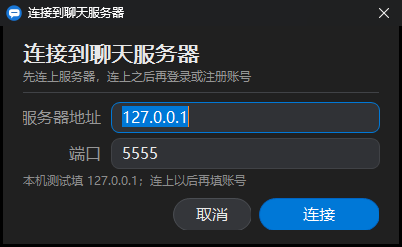
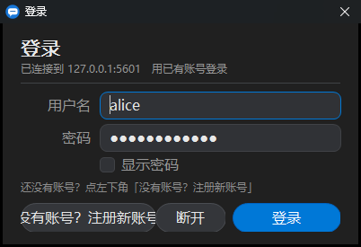
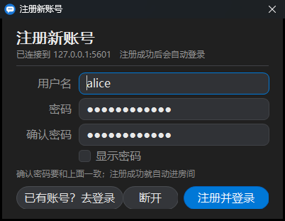
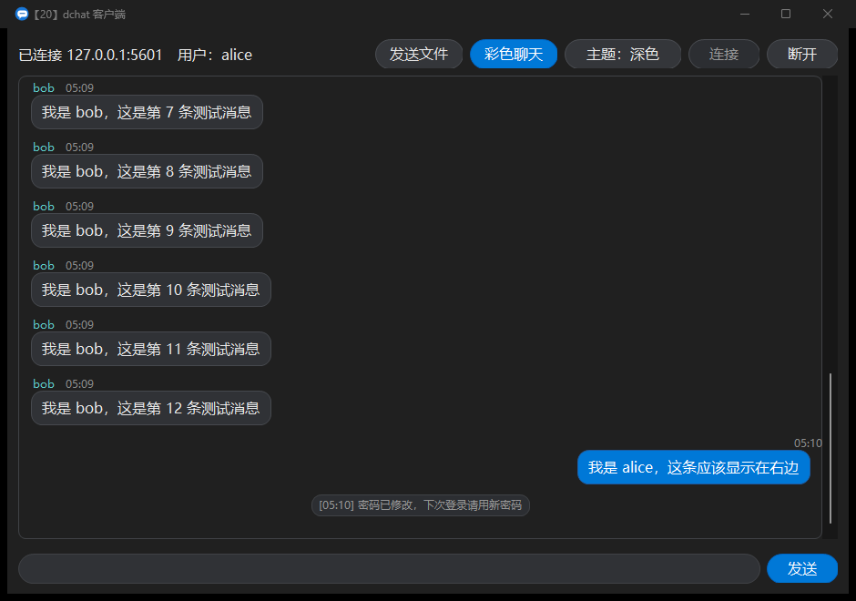
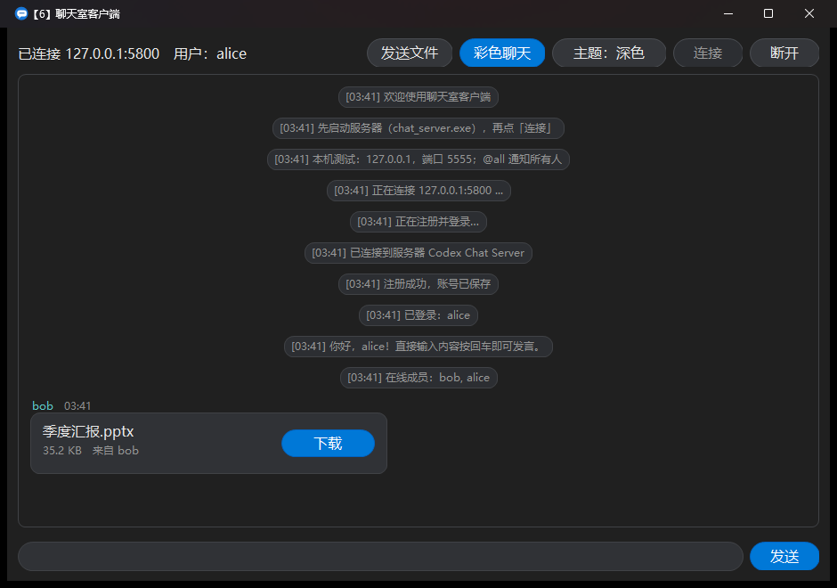
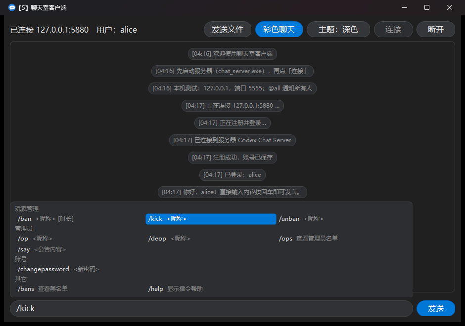
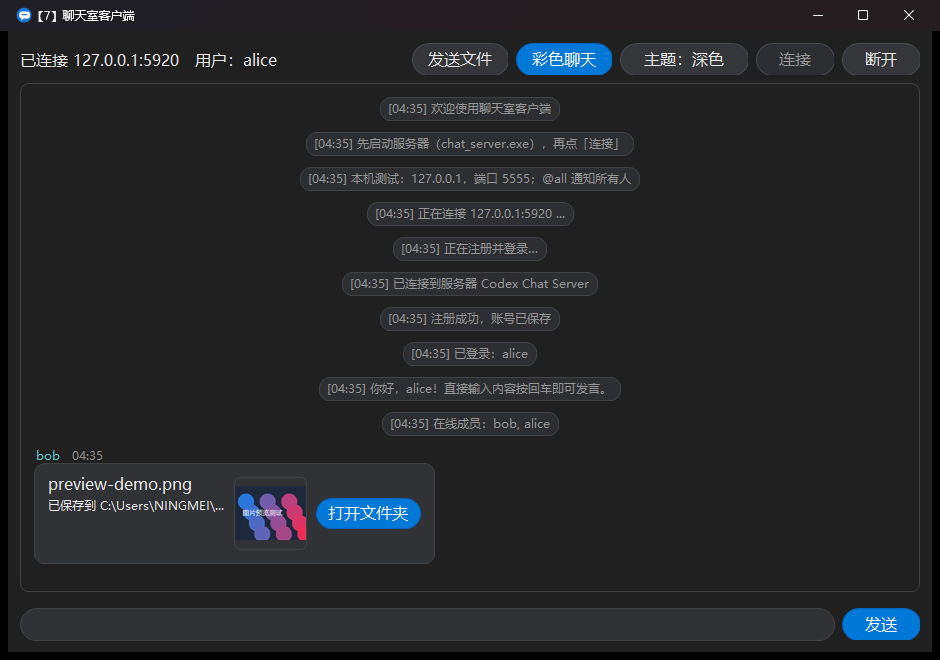

# 聊天室（C++ 客户端 + 服务器）

用 C++17 + Winsock2 手写的局域网聊天程序，**零第三方依赖**：服务器是多线程 TCP 服务，客户端是 Win32 图形界面。

**语言 / Languages：** 简体中文 ｜ [English](#english)

<a id="top"></a>

## 功能

- 服务器支持**多个客户端同时在线**，一条消息广播给所有人
- **登录 / 注册机制**：先连服务器，再在单独的窗口里登录（用户名 + 密码）或注册（多填一次「确认密码」）。账号**长期保存在服务器的账号文件里**，重启服务器依然有效
- 密码**不保存明文**：用随机盐 + PBKDF2-HMAC-SHA256（12000 次迭代）派生后保存；校验用定长比较，避免计时侧信道
- **改密码**：玩家在聊天框里发 `/changepassword <新密码>` 就能改自己的密码（**不需要管理员**）；服务器控制台可以发 `/changepassword <昵称> <新密码>` 帮别人重置。改密码会**换一个新的盐**，旧密码立刻失效，并且马上写进账号文件
- 输入历史和聊天一样：**指令也能按 `↑` 翻回来**（`/help`、`/ops`、`/ban …` 都原样记）。只有 `/changepassword`（以及它的简写 `/cp`）特殊——历史里**只保留指令名、把密码那段去掉**，这样指令能翻回来重打、密码又不会重新出现在屏幕上。服务器日志里同样**只记「谁改了哪个账号」、不记密码本身**
- **发文件（QQ 式：点了才下载）**：点右上角「发送文件」选一个文件，或者**直接把文件拖进窗口**。文件先上传到服务器，房间里其他人会收到一张**文件卡片**；卡片上点「下载」之后才开始下载，下完按钮变成「打开文件夹」，点一下就用资源管理器打开所在目录并选中该文件（`/select`）
  - 卡片状态一眼可见：`下载` → `下载中 45%`（卡片底部还有进度条）→ `打开文件夹`；失败会变成 `重试` 并写明原因
  - **图片 / 视频会自动出缩略图**：下载完若是指明了扩展名的图片（png/jpg/jpeg/bmp/gif/webp/ico/tif）或视频（mp4/mkv/avi/mov/wmv/flv/webm/m4v/mpg/mpeg/ts），卡片右侧会显示一张圆角缩略图 —— 图片是缩小图，**视频显示第一帧**；点缩略图用系统默认程序打开文件。缩略图交给 Windows 自带的缩略图提供者（`IShellItemImageFactory`）生成，所以**不引第三方库**，视频靠系统已装的解码器；系统没装对应解码器时就不显示缩略图，卡片其它功能照常
  - **图片自动下载**：收到 `.png/.jpg/...` 这类图片时不用点，客户端会自己下下来并直接显示缩略图
  - **视频只拉第一帧做预览**：发送方在本地就把第一帧抽出来（PNG）随文件一起传给服务器；接收方收到视频卡片时**只下这一小张预览图**（几十 KB），不会把整段视频拉下来 —— 想拿完整视频再点卡片上的「下载」。所以视频卡片上看到的是"第一帧预览 + 下载按钮"
  - **整张卡片都可以点**（和 QQ 一样，点文件名也能下载），鼠标悬停时按钮会高亮；下载期间状态栏也显示 `下载 报告.pdf 62%`
  - 文件名走 Base64，中文名（甚至 emoji）都能原样送达；保存前会**清理文件名**：只取最后一段（挡掉 `../../evil.exe` 这类路径穿越）、替换 Windows 非法字符、去掉结尾的空格和点、限制长度，重名时自动改成 `报告 (2).pdf`
  - 下载下来的文件放在客户端 exe 同级的 `received\` 目录；**没下完的半个文件会被删掉**（下载失败、连接断开都会清理），不会在硬盘上留垃圾
  - 单个文件上限 **64 MB**；发送在**独立线程**里做，界面不会卡住
  - 服务器在**内存**里暂存上传的文件：**单个 64 MB、最多 16 个、总共 256 MB、30 分钟过期**，超出就先淘汰最旧的；服务器重启后暂存的文件就没了（那时点下载会提示"文件不存在或已经过期"）
  - 脚本/其他程序也可以把一个文件路径交给已经打开的客户端来上传（`WM_COPYDATA`，`dwData = 0x43484131`，数据是 UTF-8 路径），自动化测试就是走这条入口
- 客户端图形界面：**两步式连接**——先填服务器地址 / 端口连上去，连上之后再在单独的窗口里**登录或注册**；微信式气泡记录区、输入框（回车发送）
- 用户名即聊天昵称：长度、字符集检查，重复注册和同一账号重复上线都会被拒绝
- 系统提示：谁加入、谁离开、在线成员列表
- 支持中英文（协议为 UTF-8，界面用 UTF-16 显示）
- 半包 / 粘包 / 超长行都能正确处理（有单元测试覆盖）
- 连接带 4 秒超时、聊天数据关闭 Nagle（消息更跟手）
- **微信式气泡记录区**（自绘子窗口，不是文本框）：**自己发的消息靠右**（蓝色气泡、白字），**别人的消息靠左**（浅色气泡），**系统提示居中**（灰色小胶囊）。每条消息上方有表头：别人的显示"昵称 + 时间"，自己的只显示时间；昵称用该用户的固定颜色
- 支持鼠标滚轮和右侧滚动条，新消息到达时如果本来就在底部会自动跟随；往上翻看历史时不会被新消息拽回去
- **输入历史（类似 Minecraft 聊天）**：在输入框里按 `↑` 翻出你刚发过的内容——**聊天和指令都记**（`/help`、`/ban alice 1h` 这些也能翻回来）；连续按会依次往前翻，按 `↓` 往回翻，翻过最新一条就回到你原来正在写的内容（草稿不会被冲掉）。**没有任何历史时按 `↑` 什么都不做**；按 `Esc` 退出翻历史状态。发送成功后自动记录，最多保留最近 200 条
  - 唯一的例外是 `/changepassword`：历史里只留下 `/changepassword `，密码那段会被去掉——这样指令能翻回来，密码又不会重新显示在屏幕上
- **Tab 补全（类似 Minecraft）**，两部分都做了：
  - **补指令名**：输入 `/` 之后按 `Tab` 会**依次循环**所有指令（`/ban` → `/bans` → `/changepassword` → …），打到一半再按就按前缀补全（`/he` + `Tab` → `/help`，`/CH` + `Tab` → `/changepassword`，前缀不区分大小写）
  - **补昵称参数**：第一条参数是昵称的指令（`/ban`、`/kick`、`/unban`、`/op`、`/deop`、`/ip`）在空格之后按 `Tab` 会**循环补全**（`/kick ` + `Tab` → `/kick alice` → `/kick bob` → …），也可以先打前缀（`/kick b` + `Tab` → `/kick bob`）；`/say`、`/changepassword` 这类不补
    - 名单 = **当前在线成员** + 服务器下发的**已注册账号**：所以 `/ban`、`/op`、`/unban`、`/ip` 也能补到**已经离线的人**（`/unban ca` + `Tab` → `/unban carol`），候选分成 `在线成员` 和 `已注册玩家` 两组
    - 登录成功后服务器会发一行 `KNOWN`（已注册账号 + 管理员 + 黑名单里的名字，就是 Tab 用来补参数的那份名单）；名单变了（有人注册、被 ban/unban、被 op/deop）会自动重发，客户端断开连接时清空
  - **补 `/chatrule` 的规则名和取值**：`/chatrule ` + `Tab` 会列出四条规则（分组 `服务器规则`，每条后面带灰色说明），可以打前缀（`/chatrule ch` + `Tab` → `/chatrule chatinterval`）；第二个参数对数值规则补 `set` / `add` / `remove`，对布尔规则（`keepchathistory`）补 `set` / `true` / `false`（`/chatrule keepchathistory ` + `Tab` → `set` → 再按 → `true`）
  - **候选显示在输入框正上方**（和 MC 一样）：一开始输入 `/` 就会在输入框上方浮出一块候选面板（3 列排布），**随打字实时更新**；按 `Tab` 或 **`↑`/`↓`** 在候选之间移动时，当前选中的那个会用强调色高亮（比如 `/kick ` + `Tab` 时 `bob` 高亮、输入框补成 `/kick bob`）；也可以**直接用鼠标点某个候选**来选它
  - 候选项**带灰色用法说明**：`/ban <昵称> [时长]`、`/say <公告内容>`、`/ops 查看管理员名单`……名字是亮色、说明是灰色
  - 候选**按类别分组**显示：`玩家管理`（ban/kick/unban）、`管理员`（op/deop/ops/say/ip/chatrule）、`账号`（changepassword/cp）、`其它`（bans/help）；补昵称参数时是 `在线成员` / `已注册玩家` 两组，补 `/chatrule` 时是 `服务器规则` / `写法` / `取值` 几组
  - 浮层开着时 `↑`/`↓` 用来**选候选**（不再翻聊天历史）；想翻历史就先按 `Esc` 把浮层收起来
  - 面板只在有候选时出现：清空输入、按下 `Esc`、把消息发出去、或者改成不匹配的内容时会自动收起；浮层高度随候选行数变化（最多 4 行）
  - 没有匹配、或者那个位置本来就没有候选（比如 `/ban alice ` 之后的时长）时按 `Tab` 不会有任何变化；Tab 会被输入框吞掉，焦点不会跳到别的控件
- **输入框的圆角由父窗口绘制，编辑框内嵌在里面并且是透明的**：父窗口在 `WM_PAINT` 里把输入框区域画成胶囊（`ui::DrawRoundedControl`），编辑框缩小 `12×5` 像素内嵌其中、`WM_CTLCOLOREDIT` / `WM_CTLCOLORSTATIC` 都返回空画刷（不刷矩形底色），只负责画文字。这样圆角天然贴合，文字也自带内边距。
  - 试过但不可行的三种做法（都实测过）：① `SetWindowRgn` 给编辑框设圆角区域——`GetWindowRgn` 能查到区域，但编辑框背景并没有被裁掉，四角仍是方形；② 在编辑框的 `WM_ERASEBKGND` 里自绘圆角——编辑框根本不发这个消息；③ 用 `EM_SETMARGINS` 给文字加内边距——加上之后编辑框不再绘制文字（所以改成让控件内嵌来获得内边距）
- 居中的系统提示比正文更小一号：字号 −12（正文 −16）、内边距 8/3（正文 12/8），所以提示条又小又紧凑
- 右上角有「彩色聊天」开关：取消勾选后所有气泡统一成灰白配色（昵称也不再着色），便于截图或偏好单色的场景
- **时间戳**：服务器发出的每条消息都带 `hh:mm`，客户端显示成 `[21:05]` 前缀；本地提示（正在连接、已断开）用本机时间，且时间在产生那一刻就固定下来，之后切换主题或重绘不会变
- **主题三态，默认深色**：右上角按钮在「深色 → 浅色 → 跟随系统」之间循环，按钮上直接显示当前模式；选「跟随系统」时会读 Windows 的浅色/深色设置，并监听系统主题变化实时切换（`WM_SETTINGCHANGE`）。正文、昵称、系统提示、错误、时间戳、@提及六类颜色各有浅色/深色两套，记录区背景、输入框、状态栏一起切换
  - **系统绘制的部分也跟着切**：记录区的滚动条和窗口标题栏本来是系统按浅色画出来的，现在通过 `SetWindowTheme(hwnd, L"DarkMode_Explorer")` 和 `DwmSetWindowAttribute(DWMWA_USE_IMMERSIVE_DARK_MODE)` 一起切换，深色下不会再出现一条白色滚动条或浅色标题栏
- **圆角自绘界面**：所有按钮和开关都是自绘的圆角胶囊控件（`BS_OWNERDRAW` + `WM_DRAWITEM`），带悬停高亮和按下反馈；主操作「发送」用强调色，开关打开时也是强调色；记录区与输入框画了圆角外框
- **两步式连接：先连服务器，再登录 / 注册**（和 QQ、微信一样，账号不在第一步填）
  - 第一步只有一个**「连接到聊天服务器」**窗口：**服务器地址 + 端口**两个输入框（默认 `127.0.0.1` / `5555`，只记住上次连的地址和端口）。点「连接」才开始连，连不上会在记录区给出中文原因
  - 连上之后才弹第二步的**账号窗口**，而且**登录和注册是两个不同的窗口**：
    - 「登录」窗口：标题「登录」，只有 **用户名 + 密码**，主按钮是「登录」
    - 「注册新账号」窗口：标题「注册新账号」，多了 **确认密码**，主按钮是「注册并登录」
    - 左下角的按钮在两者之间切换（`没有账号？注册新账号` / `已有账号？去登录`），**已经填好的用户名和密码会带过去**，不用重打；切换是先把旧窗口关掉再开新窗口，所以不会两个窗口叠在一起
  - 状态栏在连上但还没登录时显示 **「已连接 <地址> 未登录」**，登录 / 注册成功后变成「已连接 <地址>　用户：<用户名>」
  - **登录 / 注册失败不再断开连接**：服务器的原因（用户名不存在、密码错误、昵称已被占用……）直接以红字显示在账号窗口底部，用户可以改完直接再提交，或者切到另一个界面；只有点「断开」/ 关掉窗口才会断开这次连接
  - 账号窗口里的编辑框是**圆角底板**（当前焦点那一行用强调色描边），编辑框无边框内嵌在底板里，所以文字自带内边距、圆角不会被方形底色盖住；按钮和主窗口一样是圆角自绘（主操作「登录」/「注册并登录」用强调色，「断开」是中性色，都有悬停/按下反馈）
  - 窗口**居中显示在主窗口上**，标题栏放应用图标；回车提交、Esc 断开、Tab 在字段间切换；打开时焦点直接落在「用户名」上（地址那一步是全选地址，方便直接换服务器）
  - 有一个自绘的 **「显示密码」勾选框**（勾上时小方块填强调色 + 白色对勾），勾上后密码框显示明文，方便核对；关闭状态仍然用标准圆点遮挡，密码框本身依旧带 `ES_PASSWORD` 样式
  - 编辑框**自带一个和底板同色的实心背景**（`WM_CTLCOLOREDIT` 返回实心画刷，而不是"透明"的空画刷）。这一点很关键：空画刷虽然能让父窗口的圆角透出来，但编辑框自己重画时（**勾选「显示密码」、退格删字符**）不会擦掉旧内容，屏幕上就会变成"点号 + 明文糊成一团"。因为编辑框本身内缩在圆角底板里（左右 10px / 上下 4px），用同色擦掉并不影响圆角。**注意这类残影用 `PrintWindow` 截图是看不出来的**（它会让窗口重新画一遍），必须直接 BitBlt 窗口 DC 或看真实屏幕才能复现
  - 校验不通过时**在窗口底部显示红字原因，并把焦点移到出错的那一行**，不再弹系统的浅色消息框——深色主题下那个浅色弹窗和整个界面很割裂
  - 颜色全部取自主题配色（背景、输入框、边框、焦点高亮、提示文字），深色 / 浅色两套都试过，不会再出现"深色标题栏 + 浅灰客户区"这种拼色
  - 圆角用 GDI+ 抗锯齿绘制（GDI 自带的 `RoundRect` 会有锯齿），并且**先用主题背景色铺满整个控件矩形、再画圆角形状**——否则圆角以外的四个角会残留控件 DC 里的旧内容，看起来就是"方形底色 + 圆角块"。这部分逻辑在 `src/rounded.cpp`，配有像素级回归测试
- **应用图标**：圆形蓝色底 + 白色对话气泡（带小尾巴、气泡里一条短线代表文字），由 `tools/make_dchat_icon.ps1` 生成 16/24/32/48/64/128/256 七种尺寸并编译进 exe，窗口、任务栏和资源管理器里都是它
  - 脚本支持三种风格，换一个只要重跑并重新构建：`-Style circle`（默认，圆形底）、`-Style bubble`（只有一只透明底气泡）、`-Style double`（两只重叠气泡）
- **@提及高亮**：消息里出现 `@你的昵称` 时，该气泡的边框与文字变成醒目色；`@all` 则对所有人都算提及。只有被提到的人看到高亮，其他人看到的是普通气泡。`@alicex` 不会误判成 `@alice`，`@alice，看这个`（中文标点紧跟）能正确识别
- **未读提示**：窗口不在前台时，新消息计入未读数并显示在标题栏（如 `【3】dchat 客户端`）；有人 `@我` 或 `@all` 时额外闪任务栏提醒（普通消息不闪，避免打扰）。切回窗口即自动清零

## 通信协议

一行一条消息，UTF-8 编码，用 `\n` 结尾（兼容 `\r\n`），单行上限 4096 字节。

客户端 → 服务器：

| 消息 | 说明 |
| --- | --- |
| `REGISTER <用户名> <密码>` | 注册新账号；成功后直接进入房间 |
| `LOGIN <用户名> <密码>` | 用已有账号登录；成功后进入房间 |
| `MSG <内容>` | 发言，广播给所有人（包括自己，便于回显） |
| `LIST` | 查询在线成员 |
| `FILE_SEND <传输ID> <文件名(Base64)> <字节数>` | 开始上传一个文件（服务器会暂存，别人点了才下载） |
| `FILE_CHUNK <传输ID> <Base64数据>` | 一块文件数据（每块 2048 字节原始数据） |
| `FILE_END <传输ID>` | 上传完了（服务器校验大小后暂存，并给房间里的其他人发卡片通知） |
| `FILE_CANCEL <传输ID>` | 取消这次上传 |
| `FILE_GET <服务器文件ID>` | **点卡片下载**：请求服务器把这个文件发给我 |
| `PING` | 心跳，服务器回 `PONG` |
| `QUIT` | 主动断开 |

用户名和密码之间用**一个空格**分隔，所以密码里不能含空格（最少 6 个字符、最多 64 个）。登录之前服务器不会接受发言，`MSG` 只会收到一条「请先登录后再发言」的错误提示。老协议里的 `NICK` 已废弃，发过去会提示改用 `LOGIN`。

**客户端如何判断"登录成功了"**：只看服务器回的 `LOGGEDIN`。收到 `ERROR` 就把原因显示在记录区、断开连接、状态栏回到「未连接」，用户改完再点「连接」即可；收到 `LOGGEDIN` 才显示「已登录：<用户名>」并进入房间。之所以不写成"收到任何提示就算成功"，是因为连接建立时服务器会先发一条 `WELCOME`，它会把"等待登录结果"的状态提前清掉，导致密码错误时客户端既不报错也不断开。

服务器 → 客户端：

| 消息 | 说明 |
| --- | --- |
| `WELCOME <时间> <服务器名>` | 连接成功后立即发送 |
| `LOGGEDIN <时间> <用户名>` | **认证通过**（登录或注册成功）；客户端收到它才认为"已经进入房间"，这样密码错误时不会被别的提示混淆 |
| `SAY <时间> <昵称> <内容>` | 某人的发言 |
| `JOINED <时间> <昵称>` / `LEFT <时间> <昵称>` | 加入 / 离开 |
| `NAMES <时间> <昵称列表>` | 在线成员 |
| `KNOWN <时间> <昵称列表>` | 服务器认识的昵称（已注册账号 + 管理员 + 黑名单），Tab 补全 `/ban` `/op` `/unban` `/ip` 的数据来源；不进聊天记录 |
| `SYS <时间> <文本>` | 系统提示（改名、欢迎语等） |
| `ERROR <时间> <文本>` | 出错提示（昵称非法、未知命令等） |
| `PONG <时间>` | 心跳回应 |
| `FILE_OFFER <时间> <昵称> <文件ID> <文件名(Base64)> <字节数>` | 有人上传好了：客户端显示一张可下载的文件卡片 |
| `FILE_BEGIN <文件ID> <文件名(Base64)> <字节数>` | 下载开始（回答 `FILE_GET`），客户端据此建文件 |
| `FILE_DATA <文件ID> <Base64数据>` | 一块文件数据 |
| `FILE_END <文件ID>` | 这个文件发完了 |
| `FILE_FAIL <文件ID> <原因>` | 下载失败（文件不存在或已过期等） |

`<时间>` 是服务器发出的 `hh:mm`（24 小时制）。客户端解析时该字段可省略，所以旧格式的行也能正常显示（只是不带时间戳）。

## 构建

需要 CMake 3.20+ 和支持 C++17 的编译器（本机实测 MinGW-w64 g++ 16.1）。

```powershell
cmake -S . -B build -G Ninja
cmake --build build
```

产物：

- `build\dchat_server.exe` —— 服务器
- `build\dchat_client.exe` —— 客户端（图形界面）

### 直接下载就能用（不用编译）

仓库里**已经带上了编译好的 Windows 可执行文件**，用的是 MinGW-w64 **静态链接**（把 libgcc / libstdc++ / winpthread 都链进了 exe），所以**不需要额外装 DLL、也不需要编译器**：

- `build\dchat_server.exe` —— 双击开服务器（默认端口 `5555`）
- `build\dchat_client.exe` —— 双击开客户端，点「连接」填 `127.0.0.1:5555` 就能进

第一次打开时 Windows 可能提示"未知发布者"（exe 没有代码签名），点「更多信息 → 仍要运行」即可。服务器第一次运行会在它自己的目录（`build\`）里生成 `dchat-users.txt` 用来保存账号。

## 运行

1. 先开服务器（默认端口 5555，可用 `--port` 指定）：

```powershell
.\build\dchat_server.exe
.\build\dchat_server.exe --port 6000     # 换端口
.\build\dchat_server.exe --users D:\dchat-data\dchat-users.txt   # 换账号文件位置
```

服务器启动时会打印账号文件的位置，例如 `accounts file: users.txt（密码以加盐哈希保存，不存明文）`。

2. 再开客户端（可以开多个，互相聊天）：双击 `dchat_client.exe`，点「连接」。

   **第一步：连服务器**（「连接到聊天服务器」窗口）
   - 服务器地址：本机测试填 `127.0.0.1`；局域网内其他机器填服务器那台机器的 IP（用 `ipconfig` 查看）。**只记住上次连的地址 + 端口**
   - 端口：`5555`（和服务器一致）
   - 点「连接」，连上后会立刻弹出第二步的账号窗口

   **第二步：登录或注册**（两个不同的窗口）
   - 已经有账号 → 在「登录」窗口里填**用户名 + 密码**，点「登录」
   - 第一次用这个用户名 → 点左下角 **「没有账号？注册新账号」**，换成「注册新账号」窗口，填**用户名 + 密码 + 确认密码**，点「注册并登录」（用户名和密码会从登录窗口带过去，只需要补一次确认密码）
   - 用户名就是聊天昵称（例如 `alice`）；密码 6–64 个字符、不能含空格
   - 想核对密码有没有输错，可以勾上 **「显示密码」**，密码框就会显示明文

   登录失败**不会断开连接**：原因（用户名不存在、密码错误、昵称已被占用……）会以红字显示在账号窗口底部，改完直接再点一次，或者切到另一个界面；想放弃这次连接就点「断开」（左上角关掉窗口也一样）。成功时状态栏显示「已连接 … 用户：<用户名>」，记录区出现「已登录：<用户名>」。

   进去之后想改密码：在底部输入框里发 `/changepassword 新密码` 就行（会立刻生效，下次登录用新密码）。忘了密码就找服务器那边在控制台执行 `/changepassword <你的昵称> <新密码>` 重置。

3. 在底部输入框输入内容，按回车发送。

4. 想发文件：点右上角「发送文件」挑一个文件，或者**直接把文件拖进窗口**。房间里其他人会收到一张文件卡片，**点卡片上的「下载」才开始下载**（下完按钮变成「打开文件夹」，点一下直接定位到文件）；文件保存在各自客户端的 `received\` 目录。

### 账号存储

账号存在服务器端的纯文本文件里（默认 `dchat-users.txt`，与服务器进程的工作目录相同；可用 `--users <路径>` 指定别的路径），一行一个账号：

```
# dchat-server accounts (v1): name salt pbkdf2-hash iterations
alice 2f9c... 8b41... 12000
```

只有**用户名 + 随机盐 + 派生值 + 迭代次数**，**不含明文密码**——即使文件被人看到也无法直接还原出密码。文件里出现坏行（字段不全、盐或派生值不是合法十六进制）会被跳过，不会让服务器启动失败。

账号文件是唯一的持久化数据；黑名单与管理员名单仍然只在内存里。

**忘记密码怎么办**：密码是单向哈希，任何人都反推不出原文（这也是为什么不能做"显示密码"这类命令）。正确做法是让服务器控制台执行 `/changepassword <昵称> <新密码>` 重置——改完对方在聊天框里再自己改一次即可。

### 服务端管理员指令（在服务器那个控制台窗口里直接输入）

服务器启动后可以在它的控制台里敲指令管理房间；被 `/op` 授予权限的管理员也可以**直接在聊天框里**输入这些指令。

| 指令 | 作用 |
| --- | --- |
| `/ban <昵称> [时长]` | 把昵称加入黑名单并立即踢下线；**不写时长就是永久封禁**，写了则到时间自动解封。时长单位 **w/d/h/m/s**（周/天/小时/分/秒），可组合，例如 `30s`、`10m`、`1h30m`、`2d`、`1w`；不带单位的数字按秒算 |
| `/kick <昵称>` | 把昵称**暂时**踢出房间（不封禁，对方可以立刻重新加入） |
| `/unban <昵称>` | 把昵称移出黑名单（不必等到时间到） |
| `/op <昵称>` | 授予管理员权限：该昵称之后可以在聊天框里用 `/` 开头的指令 |
| `/deop <昵称>` | 取消管理员权限 |
| `/changepassword <新密码>` | 改**自己**的密码（自助操作，**不需要**管理员权限，聊天框里就能用） |
| `/changepassword <昵称> <新密码>` | 改**别人**的密码（相当于管理员重置；**只能在服务器控制台用**，聊天框里连管理员也不行） |
| `/cp <新密码>` | 就是 `/changepassword` 的**简写**，功能完全一样（改自己的密码）；聊天框和控制台都能用 |
| `/ip <昵称>` | 查这个**在线客户端**的 **IP 和端口**（**只能在服务器控制台用**，聊天框里连管理员也不行；人不在线时会提示查不到） |
| `/chatrule` | 查看 / 修改**服务器规则**（**只能在服务器控制台用**，聊天框里连管理员也不行） |
| `/chatrule <规则> [set\|add\|remove] <值>` | 改规则：`set` 设成绝对值、`add` 加、`remove` 减；布尔规则直接写 `true` / `false` |
| `/say <文本>` | 发一条**全服公告**：客户端会用更大字号、居中、特殊颜色（浅色主题是琥珀金、深色主题是暖金）显示，适合「服务器 10 分钟后维护」这类通知 |
| `/bans` | 列出当前黑名单与各自剩余时间 |
| `/ops` | 列出当前管理员名单（`/oplist` 也行；控制台里直接敲 `ops` 也可以） |
| `/help` | 显示指令帮助 |

四条服务器规则的默认值与作用（都能用 `/chatrule` 改，**只能控制台**）：

规则**存在服务器端的 `dchat-rules.txt`** 里（一行一条 `规则名 值`，`#` 开头是注释，可以直接用记事本改；启动时读取，**改文件要重启才生效**）。用 `/chatrule` 改的话**会立刻写回这个文件**，重启服务器依然生效；文件位置可以用 `--rules <路径>` 指定。

| 规则 | 默认 | 作用 |
| --- | --- | --- |
| `chatinterval` | `0` ms | 同一个人两条消息之间至少间隔多少毫秒；`0` = 不限制。发太快的那条只会回给本人「发言太快了」，不广播 |
| `documentsize` | `64` MB | 单个文件最大大小（原来的 64 MB 上限现在由它控制；**不能超过 `maxservertemp`**）。服务器会把当前值发给客户端，客户端据此调整本地检查 |
| `keepchathistory` | `false` | 打开后，**新加入房间的客户端能看到之前的聊天记录**（公告也在内），以及还留在服务器上的文件卡片（点一下就能下载） |
| `maxservertemp` | `1048` MB | 服务端保存「文件 + 聊天记录缓存」的**总上限**；超出时先淘汰最旧的（文件和最早的聊天记录），调小时立刻生效 |

**广播**：封禁、踢人、解封、授予/取消管理员权限都会向房间里其他人发一条系统提示，例如「张三 已被管理员封禁（1 小时 30 分）」「李四 被管理员移出房间」。执行者自己会收到一条执行结果提示，不会把自己的指令当成聊天消息广播出去。

**聊天框里的指令规则**（和 Minecraft 一致）：**只要以 `/` 开头就算命令尝试**，绝不会被当成聊天消息广播出去。

| 输入 | 行为 |
| --- | --- |
| `/ban 张三 1h` | 执行指令（管理员） |
| `/bann 张三 1h`（指令名打错） | 只有发送者看到「未知指令：/bann（输入 /help 查看用法）」，不广播 |
| `/ban`（指令名对、参数不对） | 只有发送者看到用法提示，不广播 |
| `/kick 张三`（非管理员） | 只有发送者看到「你没有管理员权限」，不广播 |
| `/changepassword 新密码123` | 改自己的密码（谁都能用），只有发送者看到结果，不广播 |
| `/changepassword 张三 新密码123` | 只有发送者看到「这条指令只能在服务器控制台使用」，不广播 |
| `/changepassword 123` | 只有发送者看到「密码至少 6 个字符」（先报密码规则，而不是权限问题） |
| `ban 张三 1h`（没有 `/`） | 普通消息 |
| `你好，/ban 是什么意思`（`/` 不在首位） | 普通消息 |

例子：

```
> /ban 张三 1h30m        # 封 1 小时 30 分
> /ban 李四              # 永久封禁（不写时长）
> /kick bob              # 先把 bob 踢下线
> /op alice              # 让 alice 成为管理员（之后她可以在聊天框里执行指令）
> /say 服务器将在 10 分钟后维护   # 全服公告（大字居中显示）
> /unban 张三            # 提前解封
> /bans                  # 看黑名单剩余时间
```

说明：黑名单与管理员名单都保存在服务器进程内存里，重启服务器会清空；被封禁的人在设置昵称时会被拒绝并断开连接，提示里会写明剩余时间（永久封禁则显示"永久封禁"）。

如果局域网内连不上，多半是服务器那台机器的**防火墙**拦了：在 Windows  Defender 防火墙里给 `dchat_server.exe` 放行，或者临时允许该端口的入站连接。

## 接入公网（让外面的朋友连进来）

服务器代码本身已经为公网做好了准备：监听所有网卡（也可以用 `--bind <IPv4>` 指定）、每条连接都开了 **TCP keepalive**、客户端每 **45 秒**发一次心跳 `PING`（防止 NAT / 路由器把空闲连接回收掉），客户端填地址的地方**也支持域名**（`getaddrinfo`，所以 DDNS 域名、内网穿透域名都能直接用）。

要有公网可达的地址，按顺序试这三种：

1. **内网穿透 / 组网工具（最省事，推荐）**：装 Tailscale 或 ZeroTier，服务器和客户端都加入同一个虚拟网络，然后客户端连虚拟网里给服务器分配的那个 IP（形如 `100.x.y.z`）。**不需要动路由器、不需要公网 IP、流量还加密**，即使运营商是 CGNAT 也能用。
2. **公网 IPv6（如果运营商给）**：`ipconfig` 里能看到形如 `2408:...`、`240e:...` 的**全局** IPv6 地址就说明有（本机目前只有 `fe80::` 开头的链路本地地址，所以暂时走不通）。有的话在路由器放行 IPv6 入站、防火墙放行端口，客户端直接填那个 IPv6 地址（写法 `[2408:xxxx::1]:5555`）。注意：现在的服务端只监听 IPv4，走 IPv6 需要改造。
3. **路由器端口映射（要有公网 IPv4）**：在路由器管理页把 **TCP 端口 5555 映射到本机 `192.168.1.100`**，再在 Windows 防火墙放行该端口，客户端填运营商给你的公网 IP。如果公网 IP 是动态的，配一个 DDNS 域名（花生壳 / DuckDNS 等）填域名即可。**很多家宽运营商给的是 CGNAT（大内网）**，这种情况下端口映射无效，请用方案 1。

**安全提醒（重要）**：本程序的协议是**明文**的——密码、聊天内容在网络上都能被抓包看到。直接暴露到公网（方案 2/3）时，请**不要用你常用的密码**，最好只发临时账号；方案 1（Tailscale/ZeroTier）天生加密，安全性最好。想更彻底，可以再给协议加 TLS 或"挑战-应答"握手（属于后续可以做的改造）。

## 测试

```powershell
ctest --test-dir build --output-on-failure
```

也可以直接运行 `build\test_protocol.exe`（协议，36 项）、`build\test_render.exe`（显示规则，51 项）、`build\test_bubble.exe`（气泡布局，26 项）、`build\test_rounded.exe`（圆角绘制，15 项）、`build\test_history.exe`（输入历史，27 项）、`build\test_server_command.exe`（服务端指令与 Tab 补全，202 项）、`build\test_server_rules.exe`（服务器规则，52 项）、`build\test_auth.exe`（账号与密码，39 项）、`build\test_image_preview.exe`（图片/视频预览，14 项）和 `build\test_file_transfer.exe`（文件传输公共部分，47 项）——合计 509 项。

- 协议测试覆盖：命令解析、行构造、昵称校验（长度 / 非法字符 / 中文按字符计数）、UTF-8 按字符截断、TCP 流的半包与粘包处理、超长行拦截、消息构造格式
- 显示规则测试覆盖：SAY 行解析（昵称/正文/时间/是否自己发的——这条决定气泡靠左还是靠右）、系统提示与错误解析、时间字段可省略、@提及的各种边界（大小写、中文标点、邮箱写法不误判）、被提及者与旁观者视角差异、同一昵称配色稳定
- 气泡布局测试覆盖：**自己的消息贴右边距、别人的贴左边距、系统提示居中**、气泡高度 = 文字高 + 上下内边距、文字左右内边距、极短文字的最小宽度、超长文字被夹到宽度上限、宽度上限大于视口时不越界、换行测量（长文本变高、空文本占一行、宽度为 0 时返回空）
- 系统提示尺寸测试覆盖：提示字号小于正文字号、提示内边距小于正文内边距、同样文字下提示占的宽高都更小（防止以后改字号时又把提示条改大）
- @all 与未读测试覆盖：`@all` 的大小写与边界判定、`@all` 对旁观者也算提及、哪些消息算"给我的"（自己发的不算、系统消息不算）、未读计数与闪任务栏的触发条件、标题栏未读文本格式
- 圆角绘制测试覆盖：先把离屏画布涂成"哨兵色"，画完控件后画布上不能残留任何哨兵色像素；四个角必须是背景色（专门防止"方形底 + 圆角块"回归）；中心是填充色；半径自适应与超限夹取；只画边框时内部不受影响
- 界面冒烟测试（`tools\ui-smoke-test.ps1`）：一条命令跑完真实界面链路——启动服务器与客户端，点「连接」弹出第一步的连接窗口（断言**只有地址 + 端口两个输入框**，没有账号框），填地址连上后断言第二步的**「登录」窗口**才出现、状态栏显示「已连接 … 未登录」；故意用一个**不存在的账号**登录一次（断言窗口没被关掉、连接也没断），点「断开」断言状态栏回到「未连接」且能重连；再连一次、点「没有账号？注册新账号」断言换成了**另一个窗口**「注册新账号」（旧的登录窗口已关掉，用户名还带过来了），填用户名 / 密码 / 确认密码注册（断言状态栏变成「已连接 … 用户：alice」），然后模拟另一个用户发一批消息、让客户端自己发一条，断言"客户端发出的消息被服务器广播"、"对端看到本机昵称在线"、改密码那一行不会进输入历史（按上键翻出的仍是上一条普通消息），再用真实按键验证 Tab 补全（含 `/chatrule` 的规则名与布尔值），最后把**连接窗口**、**登录窗口**、**注册窗口**、**登录失败时的窗口**、**主窗口**、**规则候选面板**几张截图存下来人工复核。这条是唯一能覆盖滚动条/标题栏/气泡排版的方式
- 输入历史测试覆盖：没有历史时按上键无效、发一条后能翻出来、连续上键依次往前翻到最旧一条后无效、下键往回翻并恢复草稿、发送后从最新一条重新开始、连续按上键不会越界、空消息不入历史、历史条数上限
- 服务端指令测试覆盖：`/ban`（含缺昵称、缺时长、时长带空格、未知单位等错误提示）、时长解析（`30s`/`10m`/`2h`/`1d`/`1w`/`1h30m`/`1d12h`/`2w3d`/纯数字按秒/大小写）、非法时长拒绝（空、`abc`、`1x`、`0s`、负数、小数、超大数字）、`/kick`、`/unban`、`/bans`、未知指令提示、时长格式化
- `/changepassword` 解析测试覆盖：一个参数 = 改自己的密码（**不要求管理员、不标记为控制台专用**）、两个参数 = 给指定账号改密码（**标记为仅控制台可用**）、不给参数/参数太多/密码太短/密码带空格的报错、参数写错时仍然按"自助指令"报真实原因（而不是"你没有管理员权限"）、大小写不敏感、密码保持原样、控制台里不带 `/` 也能用、`keyword` 字段用于日志（不含密码），以及客户端用来判断"这行要不要进输入历史"的 `LooksLikePasswordCommand`（含 `/changepasswordx`、`/` 不在首位、没有 `/` 等边界）
- `/say` 公告测试覆盖：公告内容完整保留（含内部空格）、缺内容时给出用法提示、大小写不敏感、`LooksLikeCommand` 判定；显示侧覆盖"公告被识别为公告并保留时间与内容""公告字号更大、留白更多、可以更宽、居中显示"
- Tab 补全测试覆盖：指令名按前缀循环 / 大小写不敏感 / 用户改过内容后重新开始一轮、昵称参数（在线 + 已注册、两组分组、在线的不重复出现在已注册组、没给已注册名单时行为不变）、`/chatrule` 的规则名（四条全列、按前缀过滤、带灰色说明、Tab 补进输入框、循环）、`set`/`add`/`remove` 与布尔规则的 `true`/`false`（含先写 `set` 再补值）、数值规则的值没有候选、第 4 个参数没有候选；界面侧由冒烟测试真按键验证（`/ip a` → `/ip alice`、`/chatrule ch` → `/chatrule chatinterval`、`/chatrule keepchathistory ` 先补 `set` 再补 `true`），并把带了分组和灰色说明的候选面板截图存下来
- 管理员指令端到端测试（`tools\e2e-admin-test.ps1`）：真实启动服务器并接管它的控制台输入——封禁后目标无法加入且连接被断开、`1h` 正确解析为 3600 秒、`/unban` 后立刻可加入、`/kick` 把人踢下线但对方能立刻重连、封禁时间到自动解封、`/bans` 显示剩余情况、登录后收到 `KNOWN` 已注册名单（Tab 补全的数据来源），以及控制台 `/changepassword <昵称> <新密码>`：不给参数/只给密码时的用法提示、改完之后**新密码能登录、旧密码不能登录**、在线的那个账号会收到"密码已被管理员修改"的通知，并且**服务器日志里不会出现密码明文**
- 账号与密码测试覆盖：密码规则（空 / 太短 / 太长 / 含空格）、记录里不含明文密码、正确与错误密码的校验、同样的盐与迭代次数得到同样的派生值、换盐或换迭代次数结果不同、同一密码两次注册的盐不同、账号文件序列化与解析往返、坏行容错（字段不全、盐或派生值不是十六进制）、按名字查找
- 改密码测试覆盖：账号不存在时失败、空指针不崩溃、改完**旧密码立刻失效**、新密码能登录、**盐会换新**、改一个人不影响别人、改完写盘再读回来依然能用新密码登录，而且账号文件里**仍然没有明文密码**
- 协议端到端测试（`tools\e2e-test.ps1`）：用真实 TCP 连接跑一遍完整流程——未登录不能发言、`NICK` 已废弃、没注册就登录被拒绝、弱密码被拒绝、注册成功后收到 `LOGGEDIN` 并进入房间、重复注册同名被拒绝、密码错误被拒绝、同一账号重复上线被拒绝、账号文件里没有明文密码、消息广播 / @提及 / @all / 在线名单 / 离开通知；**在聊天框里改自己的密码**（成功、旧密码立刻失效、在聊天框里给别的账号改密码被拒绝、弱密码被拒绝），最后**重启服务器**确认新密码仍能登录、旧密码仍不能用（改动真的写进了账号文件）

## 代码结构

| 文件 | 作用 |
| --- | --- |
| `src/protocol.h` / `protocol.cpp` | 协议层：解析 / 构造消息、昵称校验、UTF-8 工具、行缓冲（拆包）。不含任何网络 API |
| `src/auth.h` / `auth.cpp` | 账号与密码：密码规则、随机盐、PBKDF2-HMAC-SHA256 派生与校验、账号文件的序列化 / 解析。用 Windows 自带的 `bcrypt.dll`，不引入第三方库 |
| `src/file_transfer.h` / `file_transfer.cpp` | 文件传输的公共部分：Base64 编解码、文件名清理（挡路径穿越）、重名改 `(2)`、分块大小与上限、字节数格式化 |
| `tests/test_file_transfer.cpp` | 文件传输公共部分的单元测试（含 RFC 4648 标准向量、路径穿越、UTF-8 截断、**最坏情况下 `FILE_DATA` 一行不超协议上限**） |
| `src/server.cpp` | 服务器：监听、每客户端一个线程、广播、在线名单、日志 |
| `src/client.cpp` | 客户端：Win32 界面（连接窗口 + 登录 / 注册两个账号窗口）+ 接收线程（用 PostMessage 把消息投递到界面线程） |
| `tests/test_protocol.cpp` | 协议层单元测试 |
| `tests/test_auth.cpp` | 账号与密码单元测试（密码规则、加盐哈希、账号文件往返、坏行容错） |
| `src/render.h` / `render.cpp` | 显示规则：解析 SAY / 系统提示、@提及判定、昵称配色、未读规则（不含任何 Windows API） |
| `tests/test_render.cpp` | 显示规则单元测试 |
| `src/bubble.h` / `bubble.cpp` | 气泡布局：左右/居中摆放、宽度上限、换行测量 |
| `tests/test_bubble.cpp` | 气泡布局测试（对齐、尺寸、换行） |
| `src/rounded.h` / `rounded.cpp` | 圆角控件绘制（GDI+ 抗锯齿 + 底色铺满），并统一管理 GDI+ 生命周期 |
| `tests/test_rounded.cpp` | 圆角控件的像素级测试：离屏渲染后逐像素检查 |
| `resources/dchat.ico` / `app.rc.in` / `resource.h` | 应用图标及其资源脚本 |
| `tools/make_dchat_icon.ps1` | 生成图标（三种风格）：`powershell -ExecutionPolicy Bypass -File tools\make_dchat_icon.ps1 -Style circle -Preview` |
| `tools/ui-smoke-test.ps1` | **界面冒烟测试**：自动启动服务器与客户端 → 点「连接」只填地址 + 端口 → 断言连上后弹出「登录」窗口（状态栏「未登录」）→ 用不存在的账号登录一次（验证失败后窗口还在、连接不断）→ 点「断开」验证回到未连接并能重连 → 切到「注册新账号」窗口注册并登录 → 模拟另一个用户发一批消息 → 再让客户端自己发一条、发一行改密码指令（验证它不进输入历史）→ 敲真实按键验证 Tab 补全（指令名、`/ip` 昵称、`/chatrule` 规则名与布尔值）→ 抓连接窗口、登录窗口、注册窗口、登录失败窗口、主窗口和规则候选面板几张截图。一条命令验证真实界面（含滚动条、标题栏、气泡左右分栏） |
| `tools/e2e-admin-test.ps1` | **管理员指令端到端测试**：接管服务器控制台输入，验证 `/ban`（含自动解封）、`/unban`、`/kick`、`/changepassword`（重置别人的密码）的真实行为 |
| `tools/e2e-test.ps1` | **协议端到端测试**：用真实 TCP 连接跑注册 / 登录 / 改密码 / 广播 / 重名 / 账号持久化的完整流程（用临时账号文件，不碰真实数据） |
| `tools/file-e2e-test.ps1` | **文件端到端测试**：上传 → 卡片 → 点击下载全流程，逐字节比对 SHA256——协议级上传/下载/重复下载、真界面客户端上传（WM_COPYDATA 入口）、真界面客户端**模拟鼠标点击卡片**下载落盘，外加未登录 / 文件过大 / 非法 ID / 不存在 / 取消 / 上传不完整等拒绝路径 |

## 已知限制 / 可以继续做的

- 密码是**明文在局域网里传输**的（协议没有做 TLS / 挑战应答），所以只适合可信内网。要更安全可以再加"服务器发随机数、客户端回 salted 摘要"的握手
- 账号支持"注册 / 登录 / 改密码"；**"找回密码"做不到**（密码是单向哈希，任何人都反推不出原文），忘了密码只能由服务器控制台 `/changepassword <昵称> <新密码>` 重置；也没有删号、没有"改密码要先验证旧密码"；管理员名单同样还没有持久化
- 黑名单与管理员名单保存在服务器内存里，重启服务器会清空（账号文件不影响）
- 没有历史消息：后加入的人看不到之前的聊天记录
- 文件是**广播式**的：上传后房间里所有在线的人都会收到卡片，**不能只发给某个人**；服务器只暂存 30 分钟（重启即失效），所以**没有离线文件、也不支持断点续传**；单个文件上限 64 MB，大文件（比如几百 MB 的视频）不适合用这个方式传
- 点「下载」后是**一次性把整份文件拉下来**（没有做分片校验和续传），下到一半断线会删掉半个文件、需要点「重试」重新来过；同时下载多个文件会让状态栏只显示其中一个的进度
- 发送文件用的「选择文件」是 Windows 自带的对话框，深色主题下它仍然是浅色的（系统对话框不跟随应用配色）；直接拖文件进窗口就没这个问题
- 没有私聊、房间、表情、图片预览
- 服务器重启后所有连接断开（客户端需重连，暂未做自动重连）

## 界面截图

| ① 连接服务器（只填地址 + 端口） | ② 登录（用户名 + 密码） | ③ 注册新账号（多一个确认密码） |
| --- | --- | --- |
|  |  |  |

| 主界面（气泡、时间戳、未读） |
| --- |
|  |

| 文件卡片（QQ 式：点了才下载） | Tab 补全（分组 + 用法说明 + ↑↓ 选择） |
| --- | --- |
|  |  |



---

<a id="english"></a>

# dchat — a LAN chat room (C++ client + server)

**Languages:** English ｜ [简体中文](#top)

A LAN chat program written by hand in C++17 + Winsock2 with **zero third-party dependencies**: the server is a multi-threaded TCP service, the client is a Win32 GUI application.

## Features

- The server keeps **many clients online at the same time**; every message is broadcast to everyone.
- **Login / registration**: connect to the server first, then log in (username + password) or register (type the confirmation password once more) in a separate window. Accounts are **stored permanently in the server's account file** and survive a server restart.
- Passwords are **never stored in plain text**: a random salt + PBKDF2-HMAC-SHA256 (12,000 iterations) is stored instead; verification uses a fixed-length comparison to avoid timing side channels.
- **Changing a password**: a player can type `/changepassword <new password>` in the chat box to change their own password (**no admin rights needed**); from the server console you can run `/changepassword <name> <new password>` to reset someone else's. Changing a password **generates a fresh salt**, the old password stops working immediately, and the account file is written right away.
- Command history works just like chat: **commands can also be recalled with `↑`** (`/help`, `/ops`, `/ban …` are all stored as-is). The only exception is `/changepassword` (and its alias `/cp`) — only the command name is kept and the password part is dropped, so you can recall the command without the password showing up on screen again. The server log likewise records **who changed which account**, never the password itself.
- **File sending (QQ style: click to download)**: click 「发送文件」 in the top right and pick a file, or **drag a file into the window**. The file is uploaded to the server first; everyone else in the room gets a **file card**. The download starts only after you click 「下载」 on the card; when it finishes the button turns into 「打开文件夹」, which opens Explorer with the file selected (`/select`).
  - Card states are visible at a glance: `下载` → `下载中 45%` (with a progress bar at the bottom of the card) → `打开文件夹`; on failure it becomes `重试` with the reason spelled out.
  - **Images / videos get thumbnails automatically**: after downloading, if the file has an image extension (png/jpg/jpeg/bmp/gif/webp/ico/tif) or a video extension (mp4/mkv/avi/mov/wmv/flv/webm/m4v/mpg/mpeg/ts), a rounded thumbnail appears on the right of the card — a scaled-down image, and **the first frame for videos**; clicking the thumbnail opens the file with the system default program. Thumbnails are produced by the thumbnail provider built into Windows (`IShellItemImageFactory`), so **no third-party library is involved** — videos rely on the codecs already installed on the system. If the matching codec is missing, no thumbnail is shown and the rest of the card still works.
  - **Images are downloaded automatically**: for `.png/.jpg/...` files no click is needed, the client downloads them and shows the thumbnail right away.
  - **Videos only pull the first frame as a preview**: the sender extracts the first frame locally (PNG) and sends it along with the file; the receiver of a video card **only downloads that small preview image** (tens of KB) instead of the whole video — click 「下载」 on the card if you want the full video. So a video card shows "first-frame preview + download button".
  - **The whole card is clickable** (like QQ — clicking the file name downloads too), and the button highlights on hover; while downloading, the status bar also shows `下载 报告.pdf 62%`.
  - File names travel as Base64, so Chinese names (even emoji) arrive intact; before saving the name is **sanitized**: only the last path segment is kept (blocking path traversal such as `../../evil.exe`), Windows-illegal characters are replaced, trailing spaces and dots are stripped, the length is capped, and duplicates become `报告 (2).pdf`.
  - Downloaded files go into the `received\` folder next to the client exe; **half-written files are deleted** (a failed download or a dropped connection cleans up), so nothing is left behind on disk.
  - The per-file limit is **64 MB**, and sending happens on a **separate thread**, so the UI never freezes.
  - The server stages uploaded files **in memory**: **64 MB each, at most 16 files, 256 MB in total, 30-minute expiry**, evicting the oldest first when over budget; staged files are lost when the server restarts (clicking download then reports "文件不存在或已经过期").
  - Scripts and other programs can also hand a file path to an already-running client for upload (`WM_COPYDATA`, `dwData = 0x43484131`, payload is a UTF-8 path) — the automated tests use this entry point.
- Client GUI: **two-step connection** — fill in the server address / port and connect first, then **log in or register** in a separate window; WeChat-style bubble transcript, input box (Enter to send).
- The username is the chat nickname: length and character-set validation, duplicate registrations and logging in twice with the same account are both rejected.
- System notices: who joined, who left, the online member list.
- Chinese and English are supported (the protocol is UTF-8, the UI is displayed as UTF-16).
- Partial packets, coalesced packets and over-long lines are all handled correctly (covered by unit tests).
- Connections have a 4-second timeout and Nagle is disabled for chat data (messages feel snappier).
- **WeChat-style bubble transcript** (a self-drawn child window, not a text box): **your own messages sit on the right** (blue bubble, white text), **other people's messages on the left** (light bubble), and **system notices are centered** (small gray capsule). Each message has a header: others show "nickname + time", your own show only the time; each nickname has a stable color.
- Mouse wheel and a scrollbar on the right are supported; when new messages arrive and you were already at the bottom the view follows along, while scrolling up through history is not yanked back by new messages.
- **Input history (like Minecraft chat)**: press `↑` in the input box to recall what you just sent — **both chat and commands are recorded** (`/help`, `/ban alice 1h` … all come back); pressing it repeatedly walks further back, `↓` walks forward again, and stepping past the newest entry restores the draft you were writing (the draft is never clobbered). **With no history at all, `↑` does nothing**; `Esc` leaves the history-browsing state. Entries are recorded after a successful send, keeping the most recent 200.
  - The only exception is `/changepassword`: history keeps just `/changepassword ` with the password part removed — so the command can be recalled while the password never reappears on screen.
- **Tab completion (similar to Minecraft)**, in both flavours:
  - **Command names**: type `/` and press `Tab` to **cycle through every command** (`/ban` → `/bans` → `/changepassword` → …); with a partial name it completes by prefix (`/he` + `Tab` → `/help`, `/CH` + `Tab` → `/changepassword`; prefixes are case-insensitive).
  - **Nickname arguments**: for commands whose first argument is a nickname (`/ban`, `/kick`, `/unban`, `/op`, `/deop`, `/ip`), pressing `Tab` after the space **cycles through candidates** (`/kick ` + `Tab` → `/kick alice` → `/kick bob` → …); a prefix works too (`/kick b` + `Tab` → `/kick bob`). Commands like `/say` and `/changepassword` do not complete.
    - The candidate list = **currently online members** + the **registered accounts** pushed down by the server, so `/ban`, `/op`, `/unban` and `/ip` can also complete **people who are already offline** (`/unban ca` + `Tab` → `/unban carol`); candidates are grouped into 「在线成员」 and 「已注册玩家」.
    - After a successful login the server sends a `KNOWN` line (registered accounts + admins + banned names — exactly the list Tab uses). It is re-sent whenever the list changes (someone registers, is banned/unbanned, opped/deopped) and cleared on disconnect.
  - **`/chatrule` completes rule names and values**: `/chatrule ` + `Tab` lists the four rules (group 「服务器规则」, each with a gray description), and prefixes work (`/chatrule ch` + `Tab` → `/chatrule chatinterval`); the second argument completes to `set` / `add` / `remove` for numeric rules and to `set` / `true` / `false` for the boolean rule (`keepchathistory`) (`/chatrule keepchathistory ` + `Tab` → `set` → press again → `true`).
  - **Candidates appear right above the input box** (just like MC): as soon as you type `/` a candidate panel floats above the input box (laid out in 3 columns) and **updates live as you type**; when you move between candidates with `Tab` or **`↑`/`↓`**, the current one is highlighted in the accent color (for example `/kick ` + `Tab` highlights `bob` and fills the box with `/kick bob`); you can also **click a candidate with the mouse** to pick it.
  - Candidates carry a **gray usage hint**: `/ban <昵称> [时长]`, `/say <公告内容>`, `/ops 查看管理员名单` … the name is bright, the hint is gray.
  - Candidates are **grouped by category**: 「玩家管理」 (ban/kick/unban), 「管理员」 (op/deop/ops/say/ip/chatrule), 「账号」 (changepassword/cp), 「其它」 (bans/help); nickname completion uses the two groups 「在线成员」 / 「已注册玩家」, and `/chatrule` uses 「服务器规则」 / 「写法」 / 「取值」.
  - While the panel is open, `↑`/`↓` **select candidates** (they no longer walk the chat history); press `Esc` first if you want to browse history.
  - The panel appears only when there are candidates: it hides itself when the input is cleared, when you press `Esc`, when the message is sent, or when the text no longer matches; its height follows the number of rows (at most 4 rows).
  - With no match, or where there simply are no candidates (for example the duration after `/ban alice `), pressing `Tab` changes nothing; the input box swallows the Tab so focus never jumps to another control.
- **The rounded input box is drawn by the parent window and the edit control is embedded (and transparent)**: the parent paints the input area as a capsule in `WM_PAINT` (`ui::DrawRoundedControl`), the edit control is inset by `12×5` pixels inside it, and both `WM_CTLCOLOREDIT` / `WM_CTLCOLORSTATIC` return an empty brush (no rectangular background) so it only draws text. Rounded corners therefore fit naturally and the text gets its padding for free.
  - Three approaches that were tried and do not work (all measured): ① `SetWindowRgn` to give the edit control a rounded region — `GetWindowRgn` does report the region, but the control's background is not clipped and the corners stay square; ② painting the rounded shape in the edit control's `WM_ERASEBKGND` — the control never receives that message; ③ `EM_SETMARGINS` to pad the text — the control then stops drawing its text at all (hence the inset control).
- The centered system notices are one size smaller than the body: font −12 (body −16), padding 8/3 (body 12/8), so the notice strip is small and compact.
- There is a 「彩色聊天」 toggle in the top right: when unchecked, every bubble uses the same gray palette (nicknames lose their colors too), which is handy for screenshots or a monochrome preference.
- **Timestamps**: every message from the server carries `hh:mm` and the client shows it as a `[21:05]` prefix; local notices (connecting, disconnected) use the local clock, fixed at the moment they are produced, so switching themes or repainting does not change them.
- **Three-state theme, dark by default**: the button in the top right cycles 「深色 → 浅色 → 跟随系统」 and shows the current mode right on the button; 「跟随系统」 reads the Windows light/dark setting and listens for system theme changes to switch live (`WM_SETTINGCHANGE`). Body text, nicknames, system notices, errors, timestamps and @mentions each have light/dark variants, and the transcript background, input box and status bar switch along with them.
  - **System-drawn parts follow along**: the transcript scrollbar and the window title bar would otherwise be painted light by the system; they are switched together through `SetWindowTheme(hwnd, L"DarkMode_Explorer")` and `DwmSetWindowAttribute(DWMWA_USE_IMMERSIVE_DARK_MODE)`, so the dark theme no longer shows a white scrollbar or a light title bar.
- **Rounded self-drawn UI**: every button and toggle is a self-drawn rounded capsule (`BS_OWNERDRAW` + `WM_DRAWITEM`) with hover highlight and press feedback; the primary 「发送」 action uses the accent color, as do toggles when on; the transcript and input box have rounded outlines.
- **Two-step connection: connect first, then log in / register** (like QQ or WeChat — the account is not part of the first step)
  - The first step is a single **「连接到聊天服务器」** window: two fields for **server address + port** (defaults `127.0.0.1` / `5555`; only the last address and port are remembered). Nothing is dialed until you press 「连接」; a failure reports the reason in the transcript.
  - Only after connecting does the second step appear — and **logging in and registering are two different windows**:
    - The 「登录」 window: titled 「登录」, only **username + password**, primary button 「登录」.
    - The 「注册新账号」 window: titled 「注册新账号」, with an extra **confirmation password** field, primary button 「注册并登录」.
    - A button in the bottom left switches between them (「没有账号？注册新账号」 / 「已有账号？去登录」), and **whatever you already typed is carried over** so you don't retype it; the switch closes the old window before opening the new one, so the two never overlap.
  - While connected but not yet logged in, the status bar reads **「已连接 <address> 未登录」**; after a successful login / registration it becomes 「已连接 <address>　用户：<username>」.
  - **A failed login / registration no longer drops the connection**: the server's reason (no such user, wrong password, nickname already taken, …) is shown in red at the bottom of the account window, and you can fix it and submit again or switch to the other window; only pressing 「断开」 (or closing the window) ends the connection.
  - The edit fields in the account windows sit on **rounded plates** (the focused row is outlined in the accent color), with the borderless edit control embedded inside, so the text gets padding and the rounded corners are not covered by a square background; the buttons are the same self-drawn rounded style as the main window (the primary 「登录」 / 「注册并登录」 uses the accent color, 「断开」 is neutral, all with hover/press feedback).
  - The windows **open centered over the main window** and carry the app icon in the title bar; Enter submits, Esc disconnects, Tab moves between fields; focus lands directly on 「用户名」 (the address step selects the address so you can immediately switch servers).
  - There is a self-drawn **「显示密码」 checkbox** (checked = accent-colored box with a white check); when checked the password fields show plain text for easy verification, and when unchecked they use the standard dots while keeping the `ES_PASSWORD` style.
  - The edit controls **have a solid background matching the plate** (`WM_CTLCOLOREDIT` returns a solid brush rather than a "transparent" empty one). This matters: an empty brush lets the parent's rounded corners show through, but the control cannot erase its old content when it repaints itself (**ticking 「显示密码」, backspacing**) and the screen turns into "dots and plain text smeared together". Since the control is inset inside the rounded plate (10px horizontally / 4px vertically), erasing with the same color does not touch the rounded corners. **Note that this kind of ghosting is invisible in `PrintWindow` screenshots** (that repaints the window); you need to BitBlt the window DC directly or look at a real screen to reproduce it.
  - When validation fails, **the reason is shown in red at the bottom of the window and focus moves to the offending row** instead of popping the system's light-colored message box — under the dark theme that light popup clashes badly with everything else.
  - All colors come from the theme palette (background, input, border, focus highlight, hint text); both dark and light have been checked, so the "dark title bar + light gray client area" mix no longer happens.
  - Rounded corners are drawn with GDI+ antialiasing (the GDI `RoundRect` is jagged), and the code **first fills the whole control rectangle with the theme background and only then draws the rounded shape** — otherwise the corners outside the rounded shape keep stale content from the control DC, which looks like "square background + rounded block". This lives in `src/rounded.cpp` and has pixel-level regression tests.
- **Application icon**: a round blue base with a white speech bubble (with a tail and a short line for text), generated by `tools/make_dchat_icon.ps1` in seven sizes (16/24/32/48/64/128/256) and compiled into the exe, so windows, the taskbar and Explorer all show it.
  - The script supports three styles — just re-run it with another style and rebuild: `-Style circle` (default, round base), `-Style bubble` (a single bubble on a transparent background), `-Style double` (two overlapping bubbles).
- **@mention highlighting**: when a message contains `@your-nickname` the bubble's border and text use a highlight color; `@all` counts as a mention for everyone. Only the mentioned person sees the highlight, everyone else sees a normal bubble. `@alicex` is not mistaken for `@alice`, and `@alice，看这个` (a Chinese comma right after) is detected correctly.
- **Unread indicator**: while the window is not in the foreground, new messages are counted and shown in the title bar (e.g. `【3】dchat 客户端`); being `@mentioned` or `@all` also flashes the taskbar (ordinary messages do not, to avoid nagging). Switching back to the window clears the count automatically.

## Wire protocol

One message per line, UTF-8 encoded, terminated by `\n` (`\r\n` is accepted too), 4096 bytes per line maximum.

Client → server:

| Message | Meaning |
| --- | --- |
| `REGISTER <username> <password>` | Register a new account; on success you enter the room right away |
| `LOGIN <username> <password>` | Log in with an existing account; on success you enter the room |
| `MSG <text>` | Say something; broadcast to everyone (including yourself, for echo) |
| `LIST` | Ask for the online members |
| `FILE_SEND <transfer-id> <filename(Base64)> <bytes>` | Start uploading a file (the server stages it; others download only when they click) |
| `FILE_CHUNK <transfer-id> <Base64 data>` | One chunk of file data (2048 raw bytes per chunk) |
| `FILE_END <transfer-id>` | Upload finished (the server validates the size, stages the file and notifies the rest of the room with a card) |
| `FILE_CANCEL <transfer-id>` | Cancel this upload |
| `FILE_GET <server-file-id>` | **Click the card to download**: ask the server to send this file to me |
| `PING` | Heartbeat; the server answers `PONG` |
| `QUIT` | Disconnect on purpose |

The username and password are separated by **a single space**, so a password cannot contain spaces (minimum 6 characters, maximum 64). Before logging in the server rejects chatting: `MSG` only gets back 「请先登录后再发言」. The old `NICK` command is deprecated and answers with a hint to use `LOGIN`.

**How the client decides that "login succeeded"**: it only looks at the `LOGGEDIN` line from the server. On `ERROR` it shows the reason in the transcript, disconnects and puts the status bar back to 「未连接」, and the user can fix the problem and press 「连接」 again; only `LOGGEDIN` shows 「已登录：<username>」 and enters the room. The reason it is not written as "any notice counts as success" is that the server sends a `WELCOME` as soon as the connection is up, which would clear the "waiting for the login result" state early — a wrong password would then neither report an error nor disconnect.

Server → client:

| Message | Meaning |
| --- | --- |
| `WELCOME <time> <server-name>` | Sent immediately after the connection is established |
| `LOGGEDIN <time> <username>` | **Authentication passed** (login or registration); the client considers itself "in the room" only after this, so a wrong password is not confused by other notices |
| `SAY <time> <nickname> <text>` | Someone said something |
| `JOINED <time> <nickname>` / `LEFT <time> <nickname>` | Joined / left |
| `NAMES <time> <nickname list>` | Online members |
| `KNOWN <time> <nickname list>` | Nicknames the server knows about (registered accounts + admins + banned names), the data source for Tab-completing `/ban` `/op` `/unban` `/ip`; not part of the chat transcript |
| `SYS <time> <text>` | System notice (renames, greetings, …) |
| `ERROR <time> <text>` | Error notice (invalid nickname, unknown command, …) |
| `PONG <time>` | Heartbeat answer |
| `FILE_OFFER <time> <nickname> <file-id> <filename(Base64)> <bytes>` | Someone finished an upload: the client shows a downloadable file card |
| `FILE_BEGIN <file-id> <filename(Base64)> <bytes>` | Download starts (the answer to `FILE_GET`); the client creates the file from it |
| `FILE_DATA <file-id> <Base64 data>` | One chunk of file data |
| `FILE_END <file-id>` | This file is fully sent |
| `FILE_FAIL <file-id> <reason>` | Download failed (no such file, expired, …) |

`<time>` is the `hh:mm` (24-hour) the server emitted. The client treats the field as optional, so older-format lines still display fine (just without a timestamp).

## Building

You need CMake 3.20+ and a C++17 compiler (verified locally with MinGW-w64 g++ 16.1).

```powershell
cmake -S . -B build -G Ninja
cmake --build build
```

Output:

- `build\dchat_server.exe` — the server
- `build\dchat_client.exe` — the client (GUI)

### Ready to run — no compiler needed

The repository **ships the compiled Windows executables**, built with MinGW-w64 and **statically linked** (libgcc / libstdc++ / winpthread are linked into the exe), so you need **no extra DLLs and no compiler**:

- `build\dchat_server.exe` — double-click to start the server (port `5555` by default)
- `build\dchat_client.exe` — double-click to start the client, press 「连接」 and enter `127.0.0.1:5555`

The first launch may trigger a Windows "unknown publisher" warning (the exe is not code-signed); choose 「更多信息 → 仍要运行」 (More info → Run anyway). On its first run the server creates `dchat-users.txt` in its own folder (`build\`) to store accounts.

## Running

1. Start the server first (default port 5555, change it with `--port`):

```powershell
.\build\dchat_server.exe
.\build\dchat_server.exe --port 6000     # use another port
.\build\dchat_server.exe --users D:\dchat-data\dchat-users.txt   # use another account file
```

On startup the server prints where the account file is, e.g. `accounts file: users.txt（密码以加盐哈希保存，不存明文）`.

2. Start the client (you can start several and chat with each other): double-click `dchat_client.exe` and press 「连接」.

   **Step 1: connect** (the 「连接到聊天服务器」 window)
   - Server address: `127.0.0.1` for a local test; on a LAN use the IP of the machine running the server (check with `ipconfig`). **Only the last address + port are remembered**
   - Port: `5555` (matching the server)
   - Press 「连接」; once connected the step-2 account window pops up immediately

   **Step 2: log in or register** (two different windows)
   - Already have an account → fill in **username + password** in the 「登录」 window and press 「登录」
   - Using this username for the first time → press **「没有账号？注册新账号」** in the bottom left to switch to the 「注册新账号」 window, fill in **username + password + confirmation password** and press 「注册并登录」 (the username and password are carried over from the login window, so you only add the confirmation)
   - The username is the chat nickname (for example `alice`); passwords are 6–64 characters and cannot contain spaces
   - To double-check the password, tick **「显示密码」** and the password fields show plain text

   A failed login **does not drop the connection**: the reason (no such user, wrong password, nickname already taken, …) appears in red at the bottom of the account window — fix it and submit again, or switch to the other window; press 「断开」 to give up on this connection (closing the window with the X does the same). On success the status bar shows 「已连接 … 用户：<username>」 and the transcript gets 「已登录：<username>」.

   To change your password later, send `/changepassword newpassword` in the input box at the bottom (it takes effect immediately; use the new password next time). If you forgot it, ask the server side to run `/changepassword <your nickname> <new password>` from the console to reset it.

3. Type into the input box at the bottom and press Enter to send.

4. To send a file: press 「发送文件」 in the top right and pick a file, or **drag a file into the window**. Everyone else in the room gets a file card, and **the download starts only when they click 「下载」 on the card** (the button then becomes 「打开文件夹」, which jumps straight to the file); files are stored in each client's `received\` folder.

### Account storage

Accounts live in a plain-text file on the server (default `dchat-users.txt`, in the server process's working directory; change it with `--users <path>`), one account per line:

```
# dchat-server accounts (v1): name salt pbkdf2-hash iterations
alice 2f9c... 8b41... 12000
```

It holds only the **username + random salt + derived value + iteration count**, **never the plain-text password** — even someone who reads the file cannot recover the password directly. Malformed lines (missing fields, a salt or derived value that is not valid hex) are skipped instead of breaking server startup.

The account file is the only persistent data; the ban list and the admin list still live in memory only.

**Forgot your password?** The password is a one-way hash, so nobody can reverse it (that is also why a "show password" command cannot exist). The correct move is to have the server console run `/changepassword <nickname> <new password>` to reset it — the other side can then change it again from the chat box.

### Server-side admin commands (typed straight into the server console window)

Once the server is running you can manage the room from its console; admins granted rights with `/op` can also **type these commands in the chat box**.

| Command | Effect |
| --- | --- |
| `/ban <nickname> [duration]` | Add the nickname to the ban list and kick it offline at once; **without a duration the ban is permanent**, with one it is lifted automatically when it expires. Units are **w/d/h/m/s** (weeks/days/hours/minutes/seconds) and can be combined, e.g. `30s`, `10m`, `1h30m`, `2d`, `1w`; a bare number counts as seconds |
| `/kick <nickname>` | **Temporarily** kick the nickname out of the room (no ban; they can rejoin immediately) |
| `/unban <nickname>` | Remove the nickname from the ban list (no need to wait for expiry) |
| `/op <nickname>` | Grant admin rights: that nickname can then use `/`-commands in the chat box |
| `/deop <nickname>` | Revoke admin rights |
| `/changepassword <new password>` | Change **your own** password (self-service, **no** admin rights needed, works from the chat box) |
| `/changepassword <nickname> <new password>` | Change **someone else's** password (an admin reset; **server console only** — even admins cannot do it from the chat box) |
| `/cp <new password>` | A **shorthand** for `/changepassword`, exactly the same (changes your own password); works in the chat box and the console |
| `/ip <nickname>` | Look up the **IP and port** of that **online client** (**server console only** — even admins cannot do it from the chat box; if the person is offline it says so) |
| `/chatrule` | Show / change the **server rules** (**server console only** — even admins cannot do it from the chat box) |
| `/chatrule <rule> [set\|add\|remove] <value>` | Change a rule: `set` to an absolute value, `add` to increase, `remove` to decrease; boolean rules take `true` / `false` directly |
| `/say <text>` | Send a **server-wide announcement**: the client shows it larger, centered and in a special color (amber in the light theme, warm gold in the dark one) — handy for notices like "服务器 10 分钟后维护" |
| `/bans` | List the current ban list with each remaining time |
| `/ops` | List the current admins (`/oplist` works too; typing `ops` in the console is fine as well) |
| `/help` | Show the command help |

The four server rules, with their defaults and effects (all changeable with `/chatrule`, **console only**):

The rules **live in `dchat-rules.txt` on the server** (one `rule-name value` per line, `#` starts a comment, editable in Notepad; read at startup, so **editing the file requires a restart**). Changing them with `/chatrule` **writes the file back immediately**, so it also survives a restart; point `--rules <path>` somewhere else to move it.

| Rule | Default | Effect |
| --- | --- | --- |
| `chatinterval` | `0` ms | Minimum gap in milliseconds between two messages from the same person; `0` = unlimited. A message that comes too fast is answered only to its sender with 「发言太快了」 and is not broadcast |
| `documentsize` | `64` MB | Maximum size of a single file (the old 64 MB cap is now controlled here; **it cannot exceed `maxservertemp`**). The server sends the current value to clients, which adjust their local checks accordingly |
| `keepchathistory` | `false` | When on, **clients that join the room later can see the earlier chat history** (announcements included) and the file cards still staged on the server (one click downloads them) |
| `maxservertemp` | `1048` MB | The **total budget** for "files + chat history cache" on the server; when exceeded the oldest items go first (oldest files and earliest chat lines), and lowering it takes effect at once |

**Broadcasting**: bans, kicks, unbans and granting/revoking admin rights all send a system notice to the rest of the room, e.g. 「张三 已被管理员封禁（1 小时 30 分）」 or 「李四 被管理员移出房间」. The person who ran the command gets the result back, and their command is never broadcast as a chat message.

**Command rules in the chat box** (same as Minecraft): **anything starting with `/` counts as a command attempt** and is never broadcast as a chat message.

| Input | Behaviour |
| --- | --- |
| `/ban 张三 1h` | Runs the command (admin) |
| `/bann 张三 1h` (typo in the command name) | Only the sender sees 「未知指令：/bann（输入 /help 查看用法）」; nothing is broadcast |
| `/ban` (right name, wrong arguments) | Only the sender sees a usage hint; nothing is broadcast |
| `/kick 张三` (not an admin) | Only the sender sees 「你没有管理员权限」; nothing is broadcast |
| `/changepassword 新密码123` | Changes your own password (anyone may do this); only the sender sees the result, nothing is broadcast |
| `/changepassword 张三 新密码123` | Only the sender sees 「这条指令只能在服务器控制台使用」; nothing is broadcast |
| `/changepassword 123` | Only the sender sees 「密码至少 6 个字符」 (password rules are reported before any permission problem) |
| `ban 张三 1h` (no `/`) | An ordinary message |
| `你好，/ban 是什么意思` (`/` is not the first character) | An ordinary message |

Examples:

```
> /ban 张三 1h30m        # ban for 1 hour 30 minutes
> /ban 李四              # permanent ban (no duration given)
> /kick bob              # kick bob off first
> /op alice              # make alice an admin (she can then run commands from the chat box)
> /say 服务器将在 10 分钟后维护   # server-wide announcement (large, centered)
> /unban 张三            # lift the ban early
> /bans                  # list ban times remaining
```

Note: the ban list and the admin list live in the server process's memory and are cleared by a restart; a banned person is refused when setting their nickname and disconnected, with the remaining time spelled out in the message ("永久封禁" for a permanent ban).

If you cannot connect over the LAN it is usually the **firewall** on the server machine: allow `dchat_server.exe` in Windows Defender Firewall, or temporarily allow inbound connections on that port.

## Exposing it to the internet (so friends outside can join)

The server code is already prepared for the internet: it listens on every interface (or `--bind <IPv4>`), every connection enables **TCP keepalive**, the client sends a `PING` heartbeat every **45 seconds** (so NAT / routers do not reap an idle connection), and the client's address field **accepts domain names** too (`getaddrinfo`, so DDNS names and tunneling domains work directly).

To get a publicly reachable address, try these three in order:

1. **Mesh VPN / tunneling tools (easiest, recommended)**: install Tailscale or ZeroTier, join the server and the clients to the same virtual network, and have clients connect to the IP that virtual network assigns to the server (like `100.x.y.z`). **No router changes, no public IP, and the traffic is encrypted** — this works even behind CGNAT.
2. **Public IPv6 (if your ISP provides it)**: if `ipconfig` shows a **global** IPv6 address such as `2408:...` or `240e:...` you have one (this machine only has link-local `fe80::` addresses, so it does not work yet). With one, allow IPv6 inbound on the router, open the port in the firewall, and have clients enter that IPv6 address (`[2408:xxxx::1]:5555`). Note: the server currently listens on IPv4 only, so IPv6 needs code changes.
3. **Router port forwarding (requires a public IPv4)**: in the router's admin page forward **TCP port 5555 to `192.168.1.100`** on this machine, allow the port in the Windows firewall, and have clients enter the public IP your ISP gave you. If that IP is dynamic, set up a DDNS name (DuckDNS, No-IP, …) and hand out the name instead. **Many home connections are behind CGNAT**, where port forwarding does not work — use option 1 in that case.

**Security note (important)**: this program's protocol is **plain text** — passwords and chat content can be captured on the network. If you expose it directly to the internet (options 2/3), **do not use a password you care about**, and preferably hand out throwaway accounts; option 1 (Tailscale/ZeroTier) is encrypted by design and the safest. For something more thorough you could add TLS or a challenge–response handshake to the protocol later.

## Tests

```powershell
ctest --test-dir build --output-on-failure
```

You can also run the binaries directly: `build\test_protocol.exe` (protocol, 36), `build\test_render.exe` (display rules, 51), `build\test_bubble.exe` (bubble layout, 26), `build\test_rounded.exe` (rounded drawing, 15), `build\test_history.exe` (input history, 27), `build\test_server_command.exe` (server commands & Tab completion, 202), `build\test_server_rules.exe` (server rules, 52), `build\test_auth.exe` (accounts & passwords, 39), `build\test_image_preview.exe` (image/video preview, 14) and `build\test_file_transfer.exe` (shared file-transfer helpers, 47) — 509 checks in total.

- Protocol tests cover: command parsing, line building, nickname validation (length / illegal characters / counting Chinese by code point), UTF-8 truncation by code point, split and coalesced TCP packets, over-long line rejection, message building format.
- Display-rule tests cover: `SAY` parsing (nickname / body / time / whether it is yours — this decides left or right), system notice and error parsing, the time field being optional, @mention edge cases (case, Chinese punctuation, email-like text not misfiring), the difference between the mentioned person's view and a bystander's, and stable colors per nickname.
- Bubble layout tests cover: **your own messages hug the right margin, others hug the left, system notices are centered**, bubble height = text height + vertical padding, horizontal text padding, a minimum width for very short text, long text clamped to the maximum width, no overflow when the maximum width exceeds the viewport, and wrap measurement (long text grows, empty text occupies one line, width 0 yields emptiness).
- System-notice sizing tests cover: notice font smaller than body font, notice padding smaller than body padding, and the same text occupying less width and height (so a later font tweak cannot silently make the strip big again).
- @all and unread tests cover: `@all` case and boundary handling, `@all` mentioning bystanders too, which messages count as "for me" (your own do not, system messages do not), the unread counter and taskbar-flash conditions, and the title-bar unread text format.
- Rounded-drawing tests cover: the offscreen canvas is filled with a "sentinel" color and no sentinel pixel may remain after drawing; the four corners must be the background color (specifically to prevent the "square base + rounded block" regression); the center is the fill color; adaptive and clamped radii; and drawing only a border leaves the interior untouched.
- UI smoke test (`tools\ui-smoke-test.ps1`): one command walks the real UI path — start the server and the client, press 「连接」 and assert the first step shows **only the address + port fields** (no account fields), fill in the address, assert that the second-step **「登录」 window** appears only after connecting and that the status bar reads 「已连接 … 未登录」; deliberately log in with a **non-existent account** (asserting the window stays open and the connection stays up), press 「断开」 and assert the status bar returns to 「未连接」 and reconnecting works; connect again, press 「没有账号？注册新账号」 and assert it becomes **a different window**, 「注册新账号」 (the old login window is gone and the username was carried over), then register with username / password / confirmation (asserting the status bar turns into 「已连接 … 用户：alice」); then simulate another user sending a batch of messages and have the client send one itself, asserting "the message sent from the client UI is broadcast by the server" and "the peer sees this machine online", that the password-change line never enters the input history (pressing ↑ still recalls the previous ordinary message), then drive real key presses to verify Tab completion (including `/chatrule` rule names and boolean values), and finally save screenshots of the **connect window**, **login window**, **register window**, **the window after a failed login**, **the main window** and the **rule candidate panel** for human review. This is the only way to cover the scrollbar, title bar and bubble layout.
- Input-history tests cover: pressing ↑ with no history does nothing, one send becomes recallable, repeated ↑ walks back to the oldest entry and then stops, ↓ walks forward and restores the draft, a successful send restarts from the newest, repeated ↑ never overruns, empty messages are not recorded, and the entry cap.
- Server command tests cover: `/ban` (missing nickname, missing duration, durations containing spaces, unknown units and other error messages), duration parsing (`30s`/`10m`/`2h`/`1d`/`1w`/`1h30m`/`1d12h`/`2w3d`/bare numbers as seconds/case), rejection of illegal durations (empty, `abc`, `1x`, `0s`, negative, decimal, absurdly large), `/kick`, `/unban`, `/bans`, unknown-command hints and duration formatting.
- `/changepassword` parsing tests cover: one argument = change your own password (**no admin required, not marked console-only**), two arguments = change a named account (**marked console-only**), errors for no arguments / too many arguments / too short a password / a password with spaces, a wrong argument count still reporting the real reason as a "self-service command" (rather than "you are not an admin"), case-insensitivity, the password being preserved verbatim, working in the console without the leading `/`, the `keyword` field used for logging (which excludes the password), and the `LooksLikePasswordCommand` helper the client uses to decide whether a line belongs in the input history (including `/changepasswordx`, `/` not first, no `/` at all).
- `/say` announcement tests cover: the announcement text is preserved exactly (inner spaces included), a usage hint when the text is missing, case-insensitivity, `LooksLikeCommand`, and on the display side "an announcement is recognized as such and keeps its time and text" plus "announcements use a larger font, more padding, a wider limit and centered layout".
- Tab completion tests cover: cycling command names by prefix / case-insensitivity / restarting a round after the user edits the text; nickname arguments (online + registered, the two groups, an online name not repeated in the registered group, unchanged behaviour when no registered list is supplied); `/chatrule` rule names (all four listed, prefix filtering, gray hints, Tab filling the input box, cycling); `set`/`add`/`remove` and `true`/`false` for boolean rules (including `set` first and then the value); no candidates for numeric rule values; no candidates for a fourth argument. On the UI side the smoke test drives real key presses (`/ip a` → `/ip alice`, `/chatrule ch` → `/chatrule chatinterval`, `/chatrule keepchathistory ` completing `set` then `true`) and saves a screenshot of the candidate panel with its groups and gray hints.
- Admin command end-to-end test (`tools\e2e-admin-test.ps1`): starts a real server and takes over its console input — a banned target cannot join and its connection is dropped, `1h` parses to 3600 seconds, `/unban` lets them in immediately, `/kick` drops them but they can reconnect at once, a ban expires on its own, `/bans` shows the remaining time, a client receives the `KNOWN` registered-name list after logging in (the data source for Tab completion), and console `/changepassword <nickname> <new password>`: usage hints with no arguments or only a password, **the new password logs in and the old one does not** afterwards, the online account receives a "your password was changed by an admin" notice, and **the server log never contains the plain-text password**.
- Account and password tests cover: password rules (empty / too short / too long / containing spaces), no plain-text password in the record, verification of right and wrong passwords, the same salt and iteration count producing the same derived value, different salts or iteration counts producing different results, two registrations of the same password using different salts, account-file serialization round trips, tolerance of malformed lines (missing fields, non-hex salt or derived value) and lookup by name.
- Password-change tests cover: failure for a missing account, no crash on a null pointer, **the old password stops working immediately**, the new one logs in, **the salt is regenerated**, changing one account does not affect others, and after writing to disk and reading back the new password still logs in while the file **still contains no plain-text password**.
- Protocol end-to-end test (`tools\e2e-test.ps1`): runs the full flow over real TCP connections — cannot chat before logging in, `NICK` is deprecated, logging in without registering is rejected, weak passwords are rejected, registering yields `LOGGEDIN` and enters the room, duplicate registration of the same name is rejected, a wrong password is rejected, the same account logging in twice is rejected, the account file has no plain-text password, message broadcast / @mentions / @all / the online list / leave notices; **changing your own password from the chat box** (success, the old password stops working at once, changing someone else's from the chat box is rejected, weak passwords are rejected); and finally **restarting the server** to confirm the new password still logs in while the old one does not (the change really reached the account file).

## Code layout

| File | Purpose |
| --- | --- |
| `src/protocol.h` / `protocol.cpp` | Protocol layer: message parsing / building, nickname validation, UTF-8 helpers, line buffering (packet splitting). Contains no networking API |
| `src/auth.h` / `auth.cpp` | Accounts and passwords: password rules, random salt, PBKDF2-HMAC-SHA256 derivation and verification, account-file serialization / parsing. Uses the bundled Windows `bcrypt.dll`, no third-party library |
| `src/file_transfer.h` / `file_transfer.cpp` | Shared file-transfer pieces: Base64 encode/decode, file-name sanitizing (blocking path traversal), `(2)` renaming for duplicates, chunk size and limits, byte-size formatting |
| `tests/test_file_transfer.cpp` | Unit tests for the shared file-transfer pieces (including RFC 4648 vectors, path traversal, UTF-8 truncation, and **a worst-case `FILE_DATA` line staying under the protocol limit**) |
| `src/server.cpp` | The server: listening, one thread per client, broadcasting, online list, logging |
| `src/client.cpp` | The client: Win32 UI (connect window + the two login / register account windows) plus the receive thread (which posts messages to the UI thread) |
| `tests/test_protocol.cpp` | Protocol-layer unit tests |
| `tests/test_auth.cpp` | Account & password unit tests (password rules, salted hashes, account-file round trips, malformed-line tolerance) |
| `src/render.h` / `render.cpp` | Display rules: parsing SAY / system notices, @mention detection, nickname colors, unread rules (no Windows API at all) |
| `tests/test_render.cpp` | Display-rule unit tests |
| `src/bubble.h` / `bubble.cpp` | Bubble layout: left/right/centered placement, width limits, wrap measurement |
| `tests/test_bubble.cpp` | Bubble-layout tests (alignment, sizes, wrapping) |
| `src/rounded.h` / `rounded.cpp` | Rounded control drawing (GDI+ antialiasing + background fill) and unified GDI+ lifetime management |
| `tests/test_rounded.cpp` | Pixel-level tests for rounded controls: render offscreen and inspect every pixel |
| `resources/dchat.ico` / `app.rc.in` / `resource.h` | Application icon and its resource script |
| `tools/make_dchat_icon.ps1` | Icon generator (three styles): `powershell -ExecutionPolicy Bypass -File tools\make_dchat_icon.ps1 -Style circle -Preview` |
| `tools/ui-smoke-test.ps1` | **UI smoke test**: starts the server and client automatically → presses 「连接」 and fills in only address + port → asserts the 「登录」 window appears after connecting (status bar 「未登录」) → logs in with a non-existent account (verifying the window stays open and the connection is not dropped) → presses 「断开」 to verify it returns to disconnected and can reconnect → switches to the 「注册新账号」 window and registers + logs in → simulates another user sending messages → has the client send one itself and one password-change command (verifying it stays out of the input history) → drives real key presses for Tab completion (command names, `/ip` nicknames, `/chatrule` rule names and booleans) → captures screenshots of the connect window, login window, register window, the failed-login window, the main window and the rule candidate panel. One command verifies the real UI (scrollbar, title bar, left/right bubble split) |
| `tools/e2e-admin-test.ps1` | **Admin command end-to-end test**: takes over the server console and verifies the real behaviour of `/ban` (including automatic expiry), `/unban`, `/kick` and `/changepassword` (resetting someone else's password) |
| `tools/e2e-test.ps1` | **Protocol end-to-end test**: drives registration / login / password change / broadcast / duplicate names / account persistence over real TCP connections (with a temporary account file, never touching real data) |
| `tools/file-e2e-test.ps1` | **File end-to-end test**: the whole upload → card → click-to-download flow with byte-for-byte SHA256 comparison — protocol-level upload/download/re-download, upload from the real GUI client (the WM_COPYDATA entry point), and a **simulated mouse click on the card** in the real GUI client to save the file, plus the rejection paths (not logged in / too large / bad ID / missing / cancelled / incomplete upload) |

## Known limitations / possible next steps

- Passwords are **sent in plain text over the LAN** (the protocol has no TLS or challenge–response), so this is only suitable for a trusted network. For more safety you could add a handshake where the server sends a nonce and the client answers with a salted digest.
- Accounts support "register / log in / change password"; **password recovery is impossible** (a one-way hash cannot be reversed by anyone), so a forgotten password can only be reset from the server console with `/changepassword <nickname> <new password>`; there is also no account deletion and no "verify the old password before changing" flow, and the admin list is not persisted either.
- The ban list and the admin list live in server memory and are cleared by a restart (the account file is unaffected).
- There is no message history: someone who joins later cannot see earlier chat.
- Files are **broadcast**: once uploaded, everyone currently in the room gets a card, and **you cannot send to just one person**; the server stages files for only 30 minutes (and loses them on restart), so **there are no offline files and no resumable transfers**; the per-file limit is 64 MB, and large files (a few hundred MB of video, say) are a poor fit for this mechanism.
- Clicking 「下载」 **pulls the whole file in one go** (no per-chunk verification or resume); losing the connection halfway deletes the partial file and you have to click 「重试」 to start over, and downloading several files at once only shows one of them in the status bar.
- The 「选择文件」 dialog for sending files is the Windows one and stays light under the dark theme (system dialogs do not follow the app palette); dragging a file into the window avoids the issue.
- No private messages, rooms, emoji or image previews.
- Restarting the server drops every connection (the client has to reconnect; automatic reconnection is not implemented yet).

## Screenshots

| ① Connect (address + port only) | ② Log in (username + password) | ③ Register (one extra confirmation) |
| --- | --- | --- |
|  |  |  |

| Main window (bubbles, timestamps, unread) |
| --- |
|  |

| File card (QQ style: click to download) | Tab completion (groups + usage hints + ↑↓ selection) |
| --- | --- |
|  |  |


